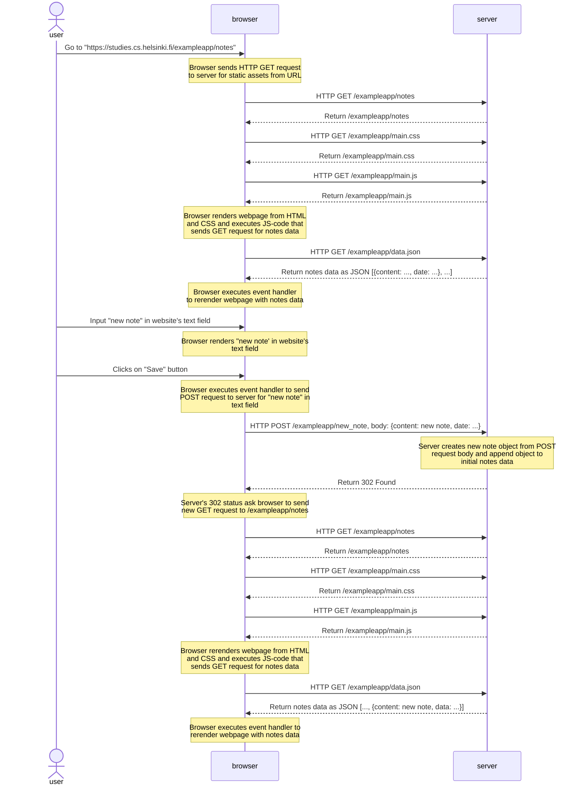

```mermaid
sequenceDiagram 
  actor user
  participant browser
  participant server

  user->>browser: Go to "https://studies.cs.helsinki.fi/exampleapp/notes"

  note over browser: Browser sends HTTP GET request <br> to server for static assets from URL

  browser->>server: HTTP GET /exampleapp/notes
  server-->>browser: Return /exampleapp/notes
  browser->>server: HTTP GET /exampleapp/main.css
  server-->>browser: Return /exampleapp/main.css
  browser->>server: HTTP GET /exampleapp/main.js
  server-->>browser: Return /exampleapp/main.js

  note over browser: Browser renders webpage from HTML <br> and CSS and executes JS-code that <br> sends GET request for notes data

  browser->>server: HTTP GET /exampleapp/data.json
  server-->>browser: Return notes data as JSON [{content: ..., date: ...}, ...]

  note over browser: Browser executes event handler <br> to rerender webpage with notes data

  user->>browser: Input "new note" in website's text field

  note over browser: Browser renders "new note' in website's <br> text field

  user->>browser: Clicks on "Save" button

  note over browser: Browser executes event handler to send <br> POST request to server for "new note" in <br> text field

  browser->>server: HTTP POST /exampleapp/new_note, body: {content: new note, date: ...}

  note over server: Server creates new note object from POST <br> request body and append object to <br> initial notes data

  server-->>browser: Return 302 Found

  note over browser: Server's 302 status ask browser to send <br> new GET request to /exampleapp/notes

  browser->>server: HTTP GET /exampleapp/notes
  server-->>browser: Return /exampleapp/notes
  browser->>server: HTTP GET /exampleapp/main.css
  server-->>browser: Return /exampleapp/main.css
  browser->>server: HTTP GET /exampleapp/main.js
  server-->>browser: Return /exampleapp/main.js

  note over browser: Browser rerenders webpage from HTML <br> and CSS and executes JS-code that <br> sends GET request for notes data

  browser->>server: HTTP GET /exampleapp/data.json
  server-->>browser: Return notes data as JSON [..., {content: new note, data: ...}]

  note over browser: Browser executes event handler to <br> rerender webpage with notes data
```