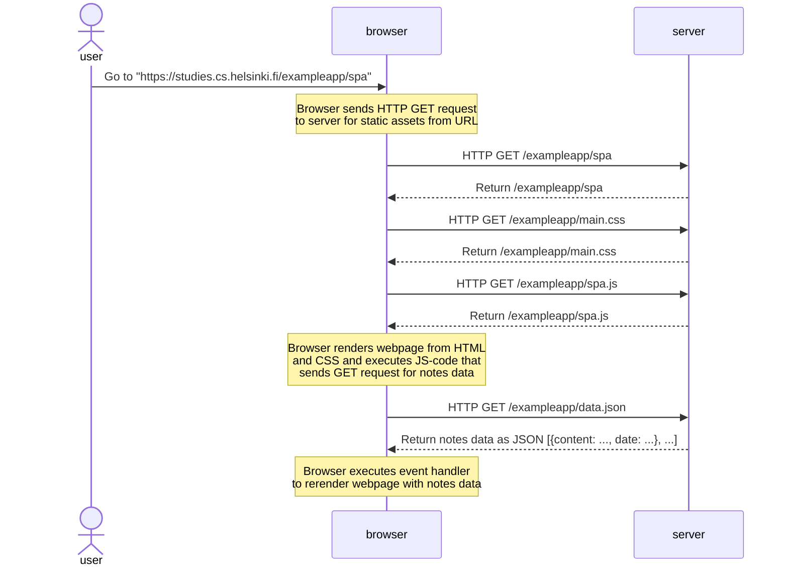

```mermaid
sequenceDiagram
  actor user
  participant browser
  participant server

  user->>browser: Go to "https://studies.cs.helsinki.fi/exampleapp/spa"

  note over browser: Browser sends HTTP GET request <br> to server for static assets from URL

  browser->>server: HTTP GET /exampleapp/spa
  server-->>browser: Return /exampleapp/spa
  browser->>server: HTTP GET /exampleapp/main.css
  server-->>browser: Return /exampleapp/main.css
  browser->>server: HTTP GET /exampleapp/spa.js
  server-->>browser: Return /exampleapp/spa.js

  note over browser: Browser renders webpage from HTML <br> and CSS and executes JS-code that <br> sends GET request for notes data

  browser->>server: HTTP GET /exampleapp/data.json
  server-->>browser: Return notes data as JSON [{content: ..., date: ...}, ...]

  note over browser: Browser executes event handler <br> to rerender webpage with notes data 
```