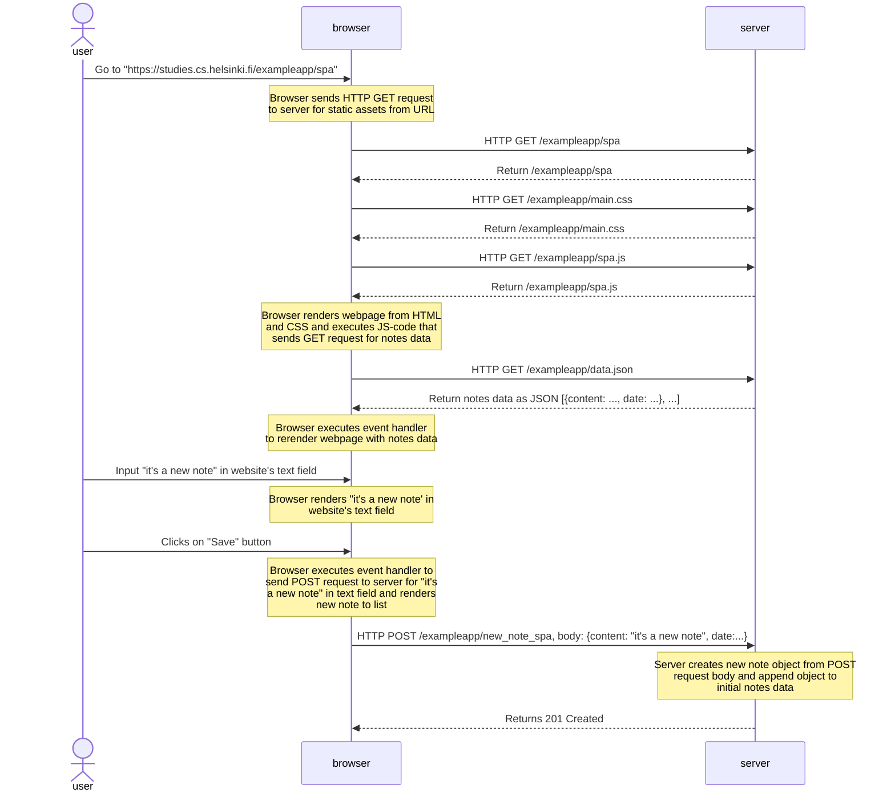

```mermaid
sequenceDiagram
  actor user
  participant browser
  participant server

  user->>browser: Go to "https://studies.cs.helsinki.fi/exampleapp/spa"

  note over browser: Browser sends HTTP GET request <br> to server for static assets from URL

  browser->>server: HTTP GET /exampleapp/spa
  server-->>browser: Return /exampleapp/spa
  browser->>server: HTTP GET /exampleapp/main.css
  server-->>browser: Return /exampleapp/main.css
  browser->>server: HTTP GET /exampleapp/spa.js
  server-->>browser: Return /exampleapp/spa.js

  note over browser: Browser renders webpage from HTML <br> and CSS and executes JS-code that <br> sends GET request for notes data

  browser->>server: HTTP GET /exampleapp/data.json
  server-->>browser: Return notes data as JSON [{content: ..., date: ...}, ...]

  note over browser: Browser executes event handler <br> to rerender webpage with notes data

  user->>browser: Input "it's a new note" in website's text field

  note over browser: Browser renders "it's a new note' in <br> website's text field

  user->>browser: Clicks on "Save" button

  note over browser: Browser executes event handler to <br> send POST request to server for "it's <br> a new note" in text field and renders <br> new note to list

  browser->>server: HTTP POST /exampleapp/new_note_spa, body: {content: "it's a new note", date:...}

  note over server: Server creates new note object from POST <br> request body and append object to <br> initial notes data

  server-->>browser: Returns 201 Created
```